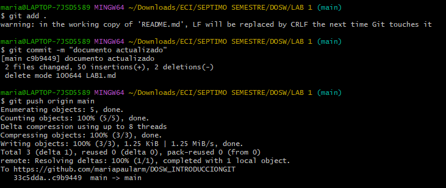

# LABORATORIO 1- INTRODUCCIÓN GIT
ESCUELA COLOMBIANA DE INGENIERÍA - CICLOS DE VIDA DE DESARROLLO DE SOFTWARE

 

- En el presente laboratorio vamos a aprender los manejos básicos de GitHub, esto con el propósito de que entiendas y comiences a trabajar con esta herramienta. Para este laboratorio se trabajará de manera individual la primera parte y con dos integrantes en la segunda parte.

## INTEGRANTES

*MARÍA PAULA RODRÍGUEZ MUÑOZ*

*JACOBO DIAZ ALVARADO*

## RESPUESTAS

## PARTE I (Trabajo Individual). 

1.	Crea un repositorio localmente.

2.	Agrega un archivo de ejemplo al repositorio, el **README.md** puede ser una gran opción.

3.	Averigua para qué sirve y como se usan estos comandos **git add** y **git commit -m “mensaje”**
#### git add
Sirve para agregar archivos nuevos o modificados en el directorio que deben incluirse en la proxima confirmación. Se usa escribiendo *git add [file name]*.

#### git commit -m "mensaje"
Sirve para guardar los cambios de un proyecto capturando el estado actual de los archivos, creando así una confirmación del mismo que puede ir acompañada de un mensaje descriptivo. Va seguido del **git add** que prepara los cambios y con el **git commit** los cambios ya preparados se guardan.

4. Abre una cuenta de github, si ya la tienes, enlazala con el correo institucional.

Ya la tenia enlazada desde el semestre pasado

   
5.	Crea un repositorio en blanco (vacío) e GitHub.

  

6.	Configura el repositorio local con el repositorio remoto.

7.	Sube los cambios, teniendo en cuenta lo que averiguaste en el punto 3

